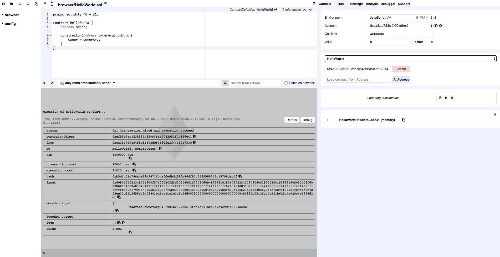
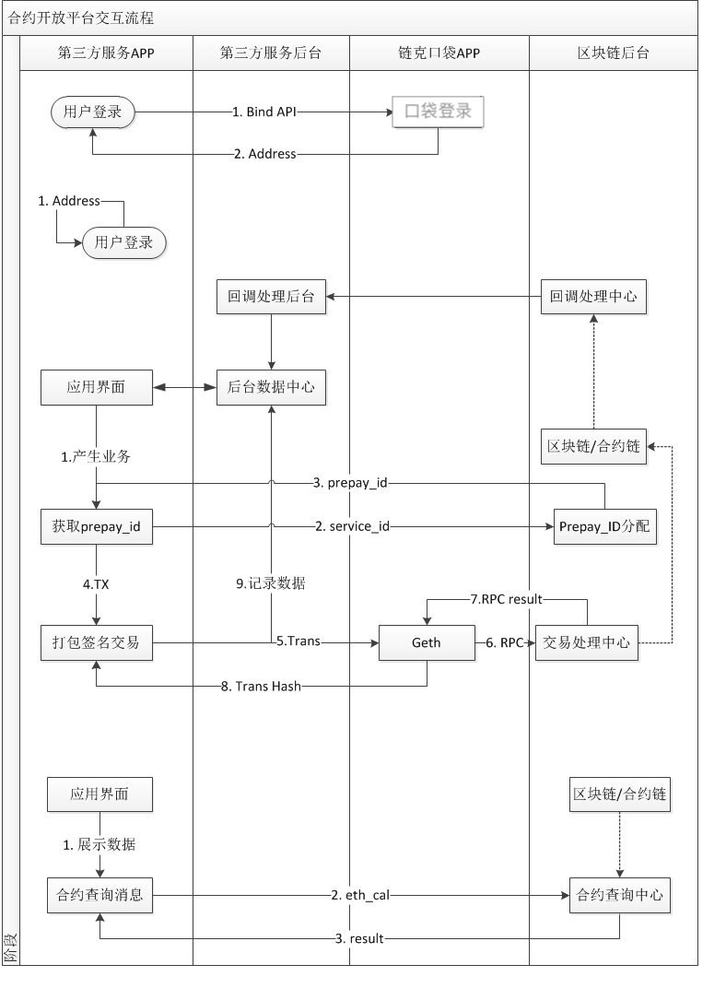

# Test Access Process

[TOC]

### Register a developer's account

1. The developer calls the *Developer Registration* interface as part of the test access APIs.
2. Based on the email address (required) and callback address (not required) submitted by the developer interface, the test platform sends to the developer's email address an email to the developer that consists of service_id and secret.
3. **All subsequent test interface requests must come with such an email address and an md5 string value created by joining the email address, service_id and secret. All interfaces of the test platform will verify the md5.**
4. The interface does not provide additional query function. If the developer's information is missing, it should be retrieved through the customer service process.

### Call the recharge interface

1. The developer calls the *Test account recharge* interface as part of the test access APIs.
2. After the recharge interface has been successfully called, the test platform will transfer 1 LinkToken to the address account submitted by the interface.
3. Because the blockchain environment for the test platform is completely independent, such a testing LinkToken may be only used in the test environment and will be invalid if it is transferred into any other blockchain environment.
4. **Each email address may initiate up to 10 transfer requests every day.**

### Develop your contract application and high-level service

1. The developer develops a contract application and packages calls to contracts through high-level service functions (implementation of App, H5, etc.).
2. Refer to Developer’s Guide to Xunlei Blockchain Competition Contract for contract development.

### Deploy contracts to ThunderChain test environment

1. Neither the test nor the formal environment of ThunderChain provides procedures whereby transactions may be sent to execute contracts directly through RPC connections. Contracts have to be published and called by calling API interfaces.
2. The developer calls the contract publishing interface to deploy a contract to the ThunderChain test environment.
3. **Because contract deployment is executed by the platform, you should avoid using msg.sender in the contract constructor method. If you have to use msg.sender for the purpose of permission and caller restrictions, you may use an argument to pass the user's address instead.**

Ex.:
```
contract HelloWorld {
  address owner;
  constructor(address ownerArg) public {
    //owner = msg.sender; Use ownerArg instead of msg.sender
    owner = ownerArg;
  }
}
```
4. The contract publishing API interface requires inputs of contract bytecode and paramaters. Byetecode comes from contract compilation. Params is coding that may be directly attached to bytecode for the purpose of deployment after the parameter for the constructor follows sign.
You may use [remix](http://remix.ethereum.org/#optimize=false&version=soljson-v0.4.23+commit.124ca40d.js) to create a contract. The "input" of the transaction on detail of the console is the data for contract deployment. However, to ensure compatibility with the input in the test environment and formal environment, the contract bytecode in the input should be passed separately from the final params and sign.


### How to call a contract

A contract may be called by either of two means: Sending a transaction to call the contract by scanning a QR code from the LinkToken Pocket app; initiating a transaction to call the contract by invoking LinkToken Pocket from the service App.

#### Invoke LinkToken Pocket
Using API, LinkToken Pocket is invoked by a service App and passed to a transaction for contract call.
**Call LinkToken Pocket from OneThing Cloud**

otst://contract/?tx-data=ZGVzYz3nlLXlvbFYWFhYJnRvPTB4MTIzNDU2Nzg5MDEyMzQ1Njc4OTAmdmFsdWU9MTIzLjQwJmdhc2xpbWl0PTUwMDAwJmRhdGE9MHgwMTAyMDMwNDAwMDAwMDAwMDAwMDAwMDAwMDAwMDAwMDAwMDAwMDAwMDAwMDAwMDAwMDAwMDAwMDAwMDAwMDAwMDAwMDAwMDEmc2lnbj0wNEI3QTU1QzQ3NDQwRDk4NUE0NDgzNkZENTVFQkVCNw==&resource=d2t5&x-source=wky&x-success=wky://x-callback-url/contractSuccess&x-error=wky://x-callback-url/contractError&x-cancel=wky://x-callback-url/contractCancel&&cb-data=base64编码后的回调透传参数
otst://contract/?tx-data=ZGVzYz3nlLXlvbFYWFhYJnRvPTB4MTIzNDU2Nzg5MDEyMzQ1Njc4OTAmdmFsdWU9MTIzLjQwJmdhc2xpbWl0PTUwMDAwJmRhdGE9MHgwMTAyMDMwNDAwMDAwMDAwMDAwMDAwMDAwMDAwMDAwMDAwMDAwMDAwMDAwMDAwMDAwMDAwMDAwMDAwMDAwMDAwMDAwMDAwMDEmc2lnbj0wNEI3QTU1QzQ3NDQwRDk4NUE0NDgzNkZENTVFQkVCNw==&resource=d2t5&x-source=wky&x-success=wky://x-callback-url/contractSuccess&x-error=wky://x-callback-url/contractError&x-cancel=wky://x-callback-url/contractCancel&&cb-data=base64 encoded callback pass-through parameter

**Explanation**
1. Contract execution service: otst://contract
1. Name of source app: resource=d2t5, decoded to "wky"
2. Callback prefix of source app: x-source=wky
3. Successful callback:  &x-success=wky://x-callback-url/contractSuccess
4. Failed callback:  &x-error=wky://x-callback-url/contractError
5. Cancelled callback: &x-cancel=wky://x-callback-url/contractCancel
6. &cb-data=abcdefg is directly returned upon callback.
8. Transaction information tx-data=ZGVzYz3nlLXlvbFYWFhYJnRvPTB4MTIzNDU2Nzg5MDEyMzQ1Njc4OTAmdmFsdWU9MTIzLjQwJmdhc2xpbWl0PTUwMDAwJmRhdGE9MHgwMTAyMDMwNDAwMDAwMDAwMDAwMDAwMDAwMDAwMDAwMDAwMDAwMDAwMDAwMDAwMDAwMDAwMDAwMDAwMDAwMDAwMDAwMDAwMDEmc2lnbj0wNEI3QTU1QzQ3NDQwRDk4NUE0NDgzNkZENTVFQkVCNw==

**After being decoded, it consists of the following information**

1. Payment address: &to=0x12345678901234567890
2. Number of LinkTokens paid: &value=123.4
3. Max. payment fee: &gaslimit=50000
4. Calling code &data=0x010203040000000000000000000000000000000000000000000000000000000000000001
5. For title &desc=Movie XXXX
6. Signature of transaction: &sign=04B7A55C47440D985A44836FD55EBEB7

**Return (Successful)**

wky://x-callback-url/contractSuccess?cb-data=abcdefg&hash=0x12345678901234567890123456789012&data=base64编码后的回调透传参数
wky://x-callback-url/contractSuccess?cb-data=abcdefg&hash=0x12345678901234567890123456789012&data=base64 encoded callback pass-through parameter

**Return (Failed)**

wky://x-callback-url/contractError?x-source=otc&errorCode=1&errorMessage=message&data=base64编码后的回调透传参数
wky://x-callback-url/contractError?x-source=otc&errorCode=1&errorMessage=message&data=base64 encoded callback pass-through parameter

**Return (Cancelled)**

wky://x-callback-url/contractCancel?x-source=otc&data=base64编码后的回调透传参数
wky://x-callback-url/contractCancel?x-source=otc&data=base64 encoded callback pass-through parameter


**Contract call**

Contract call is referred to as the call to a function whereby the status of the contract is changed. Transfer may be made to the contract account together with the execution of the function. It is triggered by a user request inputted through the user interface.


**The steps are as follows:**

1. A third-party app receives user inputs and initiates the contract call process.
2. Using the service_id allocated by LinkToken blockchain, the user requests a prepay_id from the blockchain backend.
3. After receiving the request, the backend generates a prepay_id to the third-party app.
4. The third-party app packages the transaction, which primarily consists of the contract address, gas_limit, amount to be transferred, the function and parameter coding (ABI) for execution, signature, etc..
5. LinkToken Pocket app is invoked to send the transaction information to LinkToken Pocket.
6. LinkToken Pocket packages the transaction and sends it to the processing center for blockchain transaction. Eventually, the transaction is forwarded to the blockchain server for handling.
7. The result of the request is returned to LinkToken Pocket.
8. LinkToken Pocket informs the third-party app of the result. (Interaction of contract call is completed)

**The third-party app may synchronize data to its backend services. (Third-party functions)**

If the user provides any callback information, the callback center will inform the backend of the third-party app after the blockchain backend has processed the contract call request. The interface of the third-party app synchronizes information with its backend to present the post-transaction result.
