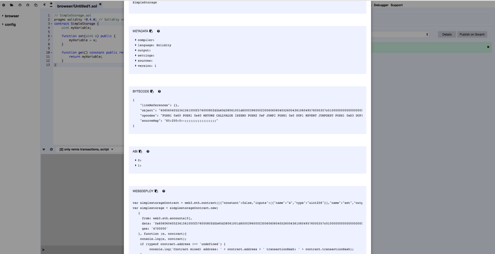

# Developer’s Guide to Xunlei Blockchain Applications Global Challenge

- [Developer’s Guide to Xunlei Blockchain Applications Global Challenge](#developers-guide-to-xunlei-blockchain-applications-global-challenge)
	- [Recommended Route for Contract Development Beginners](#recommended-route-for-contract-development-beginners)
	- [Basic Concepts](#basic-concepts)
		- [Blockchain](#blockchain)
		- [Transaction](#transaction)
		- [Account](#account)
		- [Contract](#contract)
		- [Gas](#gas)
		- [Solidity](#solidity)
		- [Notes](#notes)
	- [Developing Contracts using truffle](#developing-contracts-using-truffle)
		- [Installing truffle](#installing-truffle)
		- [Getting Started](#getting-started)
	- [Creating Interactive Contract Applications using truffle unbox](#creating-interactive-contract-applications-using-truffle-unbox)
	- [Interacting with Blockchain using Browser Add-in metamask](#interacting-with-blockchain-using-browser-add-in-metamask)
	- [Notes for Candidates to Submit Files](#notes-for-candidates-to-submit-files)

## Recommended Route for Contract Development Beginners
1. Before you develop a smart contract, you should get some idea on the basics of blockchain (See: ethereum-overview).
2. Learn the solidity language (solidity API).
3. Learn how to use truffle framework together with your study of solidity. Run your contract in a local blockchain environment provided by truffle develop.
4. Learn to use zeppelin-solidity (a standardized contract framework for security) to design contract models, separate data from logic contract, control privileges security, and consider upgrade logic.
5. Learn how to interact with your contract using web3.js. Interact with a blockchain using MetaMask add-in and web service.
6. (Optional) Enable your contract application to interact with LinkToken Pocket based on the ThunderChain Guideline Documents which will be released shortly.

## Basic Concepts

### Blockchain
A blockchain technology is a decentralized and distributed computing system characterized by permanent prevention from data falsification and forgery and high openness, transparency, and trustworthiness of data. Its core technologies include, among others, Practical Byzantine Fault Tolerance Algorithm (PBFT), encryption technology, and P2P technology, etc.

### Transaction
Blockchain can be considered as a globally shared transactional database system. Any authorized software can read entries in a blockchain network. To change data in the network, you must initiate a request, or the so-called transaction in the system, accepted by all nodes.

As its meaning says, a transaction will be either fully ignored or completely applied when it is submitted to the blockchain. After it is executed, the transaction is permanently stored in the blockchain and cannot be modified or executed any longer. 

Transactions are initiated and signed by accounts in the system. Using the encryption technology, it can be initiated only by private key holders and may not be modified or falsified by any other party. As such, their authenticity and security are guaranteed.

### Account
There are two types of accounts, external accounts and contractual accounts, in a blockchain system. External accounts are controlled by their unique public-private key pairs. Contractual accounts are controlled by their codes.

An account is identified by an address, whose length is always the same no matter if the account is an external or contractual one. The address of an external account is generated by its public key while the address of a contractual one comes from its creator address and the number of transactions sent from that address, or the so-called nonce. The address of each ThunderChain contract is officially and centrally assigned. No general account can publish contracts on ThunderChain; instead, users' contracts can only be published by Xunlei after they have been officially reviewed.

The two types of accounts are treated equally within the system. Each account has a key-value storage structure, or the so-called storage, mapping 256-bits to 256-bits in the system. Each account has a balance in a unit of Wei, which can be modified by sending value-containing transactions to the account.

### Contract
A contract is a blockchain account that stores code. It is called by sending transactions to the account. Today, Solidity is a popular contract programming language. ThunderChain currently supports for Solidity-based contract submittal. 

A contract consists of a data storage, which stores the state of the contract, and functions, which are its external interface. Data query and state modification can be performed by invoking the functions.

A contract is written in a programming language and compiled into EVM bytecode. It is called by sending transactions to its account.

### Gas
Gas is the unit of payment in a blockchain. Upon creation, a transaction is charged with a certain amount of Gas. This is to limit the amount of calculation required for the transaction and to pay for its execution. While the transaction is executed, the Gas is depleted according to an EVM-specified rule.

The Gas price is a value specified by the creator of the transaction. The amount to be paid for the execution is Gas_Price*Gas. The remaining Gas, if any, after the execution is refunded to the user creating recommendation. If the Gas is insufficient, the execution fails. However, the transaction fee is not refunded in such a case to curb flood attacks and secure the system. The minimum unit of Gas price is wei, 10^18 wei = 1 LinkToken.

### Solidity
Solidity is an advanced programming language designed for smart contracts. It runs on EVM (Ethereum Virtual Machine). Its design and implementation is influenced by C++, Python and JavaScript. Solidity is a strongly-typed language supporting inheritance, polymorphism, interface, abstraction, libraries, and user-defined data types. It supports assembly instructions for programming purpose. Code is compiled to bytecode that runs on EVM. Solidity is not only the most popular language used to develop smart contracts, but also the one recommended and supported on ThunderChain.

### Notes
1. EVM (Ethereum Virtual Machine) is a virtual machine providing runtime environment for smart contracts on Ethereum. ThunderChain is compatible with EVM provided that users' constraints of the official platform are observed.
2. Accounts are of two types, external accounts (general transaction account addresses) and contractual accounts. The creation of a contract is a process whereby transactions are sent to a target account with the address 0.
3. truffle (truffle v4.1.5 solidity v0.4.21) is designated to develop smart contracts on ThunderChain. The platform operator will verify bytecode based on the source code submitted by candidates. 

## Developing Contracts using truffle
> Truffle is a framework for developing smart contracts with solidity. 
> It provides a comprehensive local environment for development, debugging, compiling, deployment, and testing.
> With the box command unbox, you may quickly build the corresponding contract structure from some boxes.

### Installing truffle 

	npm i -g truffle 

	[root@opennode sandai]# truffle version
	Truffle v4.1.5 (core: 4.1.5)
	Solidity v0.4.21 (solc-js)

### Getting Started
1. Initialize a contract project using truffle.

		mkdir simple-storage
		cd simple-storage
		truffle init

2. Create a new contract file: You may create contract/SimpleStorage.sol by running truffle create contract SimpleStorage on command line. Alternatively, you may do so directly.

		// SimpleStorage.sol
		pragma solidity ^0.4.21;
		contract SimpleStorage {
			uint myVariable; 

			function set(uint x) public {
				myVariable = x;
			}

			function get() constant public returns (uint) {
				return myVariable;
			} 
		}
3. Add migration scripts: You may add migrations/2_deploy_contract.js by running truffle create migration 2_deploy_contract on command line. Alternatively, you may do so directly.

		// 2_deploy_contract.js；if you have more than one migration scripts, you should name them in sequence. This is because truffle migrate command executes in a sequence determined by filenames.
		var SimpleStorage = artifacts.require("SimpleStorage");
		module.exports = function(deployer) {
				deployer.deploy(SimpleStorage);
		}; 

4. Execute truffle compile to compile your contract. The compiled contract is in the folder "build". Each contract has a corresponding json file, which contains bytecode and abiCode required for its deployment.
5. Edit truffle.js to configure the RPC connection for truffle to deploy your contract and interact with the blockchain.

		[root@localhost opennode]# vi truffle.js 
		module.exports = {
			networks: {
				development: {
					host: "127.0.0.1",
					port: 8545, 
					network_id: "*"
				}
			}
		};
6. Launch a default Truffle blockchain environment from the console.

		truffle develop
		Truffle Develop started at http://127.0.0.1:9545/

		Accounts:
		(0) 0x627306090abab3a6e1400e9345bc60c78a8bef57
		(1) 0xf17f52151ebef6c7334fad080c5704d77216b732
		(2) 0xc5fdf4076b8f3a5357c5e395ab970b5b54098fef
		(3) 0x821aea9a577a9b44299b9c15c88cf3087f3b5544
		(4) 0x0d1d4e623d10f9fba5db95830f7d3839406c6af2
		(5) 0x2932b7a2355d6fecc4b5c0b6bd44cc31df247a2e
		(6) 0x2191ef87e392377ec08e7c08eb105ef5448eced5
		(7) 0x0f4f2ac550a1b4e2280d04c21cea7ebd822934b5
		(8) 0x6330a553fc93768f612722bb8c2ec78ac90b3bbc
		(9) 0x5aeda56215b167893e80b4fe645ba6d5bab767de

		Private Keys:
		(0) c87509a1c067bbde78beb793e6fa76530b6382a4c0241e5e4a9ec0a0f44dc0d3
		(1) ae6ae8e5ccbfb04590405997ee2d52d2b330726137b875053c36d94e974d162f
		(2) 0dbbe8e4ae425a6d2687f1a7e3ba17bc98c673636790f1b8ad91193c05875ef1
		(3) c88b703fb08cbea894b6aeff5a544fb92e78a18e19814cd85da83b71f772aa6c
		(4) 388c684f0ba1ef5017716adb5d21a053ea8e90277d0868337519f97bede61418
		(5) 659cbb0e2411a44db63778987b1e22153c086a95eb6b18bdf89de078917abc63
		(6) 82d052c865f5763aad42add438569276c00d3d88a2d062d36b2bae914d58b8c8
		(7) aa3680d5d48a8283413f7a108367c7299ca73f553735860a87b08f39395618b7
		(8) 0f62d96d6675f32685bbdb8ac13cda7c23436f63efbb9d07700d8669ff12b7c4
		(9) 8d5366123cb560bb606379f90a0bfd4769eecc0557f1b362dcae9012b548b1e5

		Mnemonic: candy maple cake sugar pudding cream honey rich smooth crumble sweet treat

		⚠️  Important ⚠️  : This mnemonic was created for you by Truffle. It is not secure.
		Ensure you do not use it on production blockchains, or else you risk losing funds.

		truffle(develop)>
		
	This provides a local blockchain environment for truffle to run the contract. 10 accounts with the initial balance of 100 Ether for each are created by default. 
	You may also use the GUI application provided by Ganache. In such a case, the port configured to connect with should be modified.

7. Execute truffle migrate to migrate your contract on a new console (or execute migrate on truffle develop console).
8. Test the contract code using truffle develop.

		SimpleStorage.deployed().then(function(instance){return instance.get.call();}).then(function(value){return value.toNumber()})
		// 0
		SimpleStorage.deployed().then(function(instance){return instance.set(100);});
		// transaction info
		SimpleStorage.deployed().then(function(instance){return instance.get.call();}).then(function(value){return value.toNumber()});
		// 100
9. test your contract using truffle test. 
	You may create test/SimpleStorage.test.js using truffle create test SimpleStorage. Alternatively, you may do so directly.

		const SimpleStorage = artifacts.require('SimpleStorage');

		contract('SimpleStorage', function(accounts) {
			it("should assert true", function(done) {
				var simpleStorage = SimpleStorage.deployed();
				var instance;
				simpleStorage.then(res => {
					instance = res;
					return instance.get()
				}).then(value => {
					assert.equal('0', value.toNumber(), 'not equal 0')
				}).then(() => {
					instance.set(100)
				}).then(() => {
					return instance.get()
				}).then(value => {
					assert.equal('100', value.toNumber(), 'not equal 100')
				})
				done();
			});
		});

In the newly launched console, enter truffle test ./test/SimpleStorage.test.js.

10. test your contract using remix.

Your contract developed with truffle may be placed in remix to quickly simulate its deployment and call. remix provides an environment to compile and run your contract. Its console shows you details on each transaction of the contract, such as input and output augments, post-signature method, data, and transaction hash. It also supports debugging.

	1. On compile detail pane, view details on how your contract would be compiled, including bytecode, abi, and the method to quickly deploy the contract using web3.js. 
		

	2. Create your contract on run pane. You may check the transactions for the creation. 
	

## Creating Interactive Contract Applications using truffle unbox
In the aforesaid steps, the basic approach of truffle init is used to create an environment for contract compiling, deployment, and debugging. 

Next, you will create a new project using truffle unbox, which provides the truffle engineering box that is built in with some environmental dependencies for interaction with contract applications. You may check a variety of official boxes on truffle boxes. 

The box of react is used in the following steps.

1. Create a new project truf-react

		mkdir truf-react
		cd truf-react
		truffle unbox react

    The unbox procedure will download and decompress the box and execute npm install.
2. Configure truffle.js for your project

		module.exports = {
			// See <http://truffleframework.com/docs/advanced/configuration>
			// to customize your Truffle configuration!
			networks: {
				development: {
					host: '127.0.0.1',
					port: '9545',
					network_id: '*' // Match any network id
				}
			}
		};

3. Launch one truffle develop
4. Modify src/App.js

		import React, { Component } from 'react'
		import SimpleStorageContract from '../build/contracts/SimpleStorage.json'
		import getWeb3 from './utils/getWeb3'

		import './css/oswald.css'
		import './css/open-sans.css'
		import './css/pure-min.css'
		import './App.css'

		const contract = require('truffle-contract')
		const simpleStorage = contract(SimpleStorageContract)

		class App extends Component {
			constructor(props) {
				super(props)

				this.state = {
					storageValue: 0,
					web3: null,
					inputValue: 0,
					address: null
				}

				this.changeValueHandle = this.changeValueHandle.bind(this)
				this.setHandle = this.setHandle.bind(this)
			}

			componentWillMount() {
				// Get network provider and web3 instance.
				// See utils/getWeb3 for more info.

				getWeb3
				.then(results => {
					this.setState({
						web3: results.web3
					})

					// Instantiate contract once web3 provided.
					this.instantiateContract()
				})
				.catch(() => {
					console.log('Error finding web3.')
				})
			}

			instantiateContract() {
				/*
				* SMART CONTRACT EXAMPLE
				*
				* Normally these functions would be called in the context of a
				* state management library, but for convenience I've placed them here.
				*/

				this.simpleStorageSet(5)
			}

			changeValueHandle(event) {
				this.setState({
					inputValue: Number(event.target.value)
				})
			}

			setHandle() {
				this.simpleStorageSet(this.state.inputValue)
			}

			simpleStorageSet(x) {
				simpleStorage.setProvider(this.state.web3.currentProvider)

				// Declaring this for later so we can chain functions on SimpleStorage.
				var simpleStorageInstance

				// Get accounts.
				this.state.web3.eth.getAccounts((error, accounts) => {
					simpleStorage.deployed().then((instance) => {
						simpleStorageInstance = instance
						this.setState({ address: instance.address })
						// Stores a given value, 5 by default.
						return simpleStorageInstance.set(x, {from: accounts[0]})
					}).then((result) => {
						// Get the value from the contract to prove it worked.
						return simpleStorageInstance.get.call(accounts[0])
					}).then((result) => {
						// Update state with the result.
						return this.setState({ storageValue: result.c[0] })
					})
				})
			}

			render() {
				return (
					

						<nav className="navbar pure-menu pure-menu-horizontal">
								<a href="#" className="pure-menu-heading pure-menu-link">Truffle Box</a>
						</nav>

						<main className="container">
							

								

									<h1>Good to Go!</h1>
									
Your Truffle Box is installed and ready.

									<h2>Smart Contract Example</h2>
									
If your contracts compiled and migrated successfully, below will show a stored value of 5 (by default).

									
Try changing the value stored on <strong>line 59</strong> of App.js.

									
The stored value is: {this.state.storageValue}

									
deployed contract address: {this.state.address}

								

								

									<input type="number" onChange={this.changeValueHandle}/>
									<button onClick={this.setHandle}>set</button>
								

							

						</main>
					

				);
			}
		}

		export default App

The modification adds a call to the set method and displays address of the contract.
5. Launch a new console and execute npm run start
6. Access http://lcoalhost:3000 in your browser to view results of the contract
7. Use set and the input box to assign a value to storedData of the contract
8. In truffle develop, input:

    //Replace xxx with your address
    SimpleStorage.at('xxxx').then(res => {return res.get()})
    // Get a return value of BigNUmber type. Values in array c are the assigned storedData values.

## Interacting with Blockchain using Browser Add-in metamask
Refer to http://truffleframework.com/tutorials/pet-shop

## Notes for Candidates to Submit Files
To participate in the Xunlei Blockchain Applications Global Challenge, you are required to develop your smart contract using truffle v4.1.5 with solcjs v0.4.21.
As a developer, you should submit a package of your truffle project and its descriptions, which should, among others, include: 
1. Basic file structure of the truffle project:
 	build
  contracts 
	migrations 
	test 
	package.json 
	truffle.js 
	truffle-config.js 
	README.md // for the project description document; 
	node_modules are not required 
2. PPT or PDF presentations for the entire project product, which should include background, significance, App download address (optional) and using instructions of the product.

> Documents and Tools
> [solidity API](http://solidity.readthedocs.io/en/v0.4.21/index.html)  
> [truffle doc](http://truffleframework.com/docs)  
> [ganache, which provides GUI for a local blockchain environment](http://truffleframework.com/ganache/)  
> [zeppelin-solidty, a standardized contract framework for security](https://openzeppelin.org/)  
> [MetaMask, a browser add-in providing a browser with a blockchain environment via RPC connection](https://metamask.io/)  
> [web3.js, a package of Ethereum JavaScript API for blockchain interaction](http://web3js.readthedocs.io/en/1.0/index.html)  